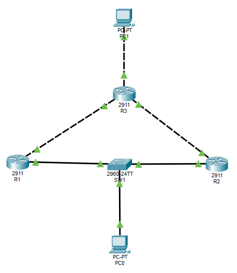
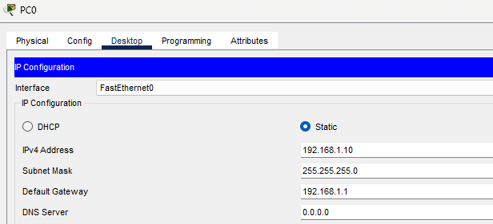
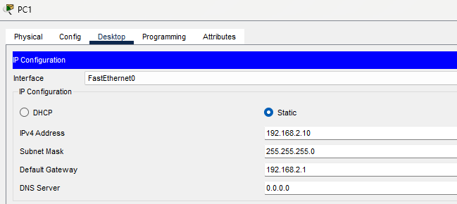
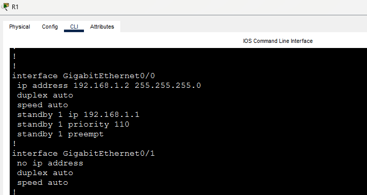
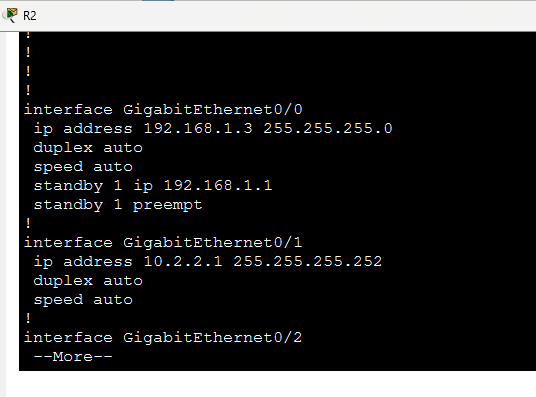
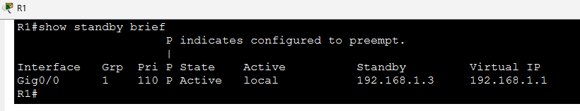
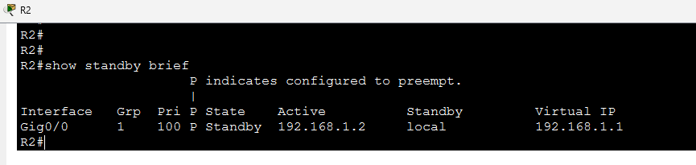
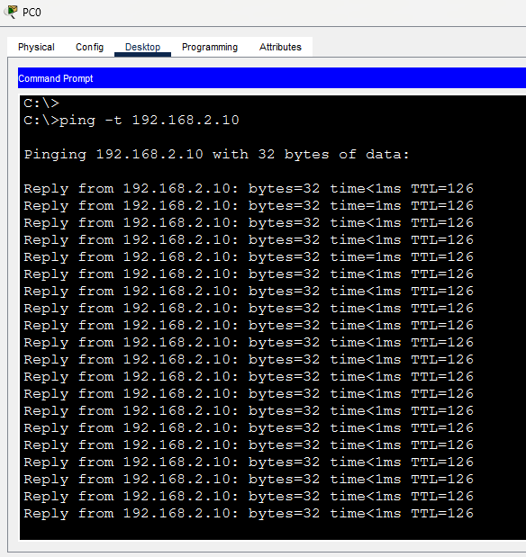
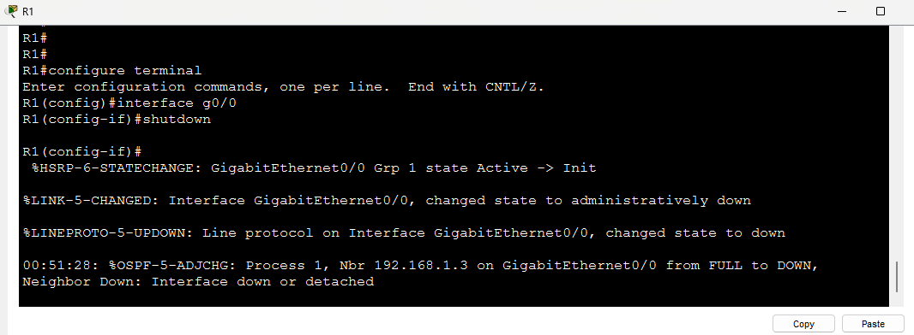
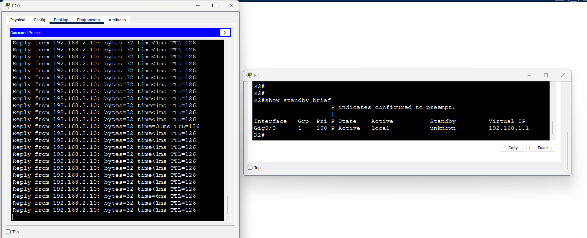

## UNIVERSIDAD DE SAN CARLOS DE GUATEMALA

### FACULTAD DE INGENIERÍA

### REDES DE COMPUTADORAS 1

  

# DOCUMENTACIÓN - ACTIVAD 6

  

**Catedrático:** Ing. Pedro Pablo Hernández Ramirez

**Auxiliar:** César Fernando Sazo Quisquinay

**Nombre:** Pablo Daniel Velásquez Hernández

**Carnet:** 202302232

**Sección:** N

**Semestre:** Segundo Semestre 2026

  

# Implementación de Redundancia de Gateway con HSRP

## 1. Resumen de Direccionamiento e Información de Red

| Dispositivo / Interfaz | Dirección IP / Máscara | Gateway Configurado | Rol / Parámetro HSRP |
|---|---|---|---|
| IP Virtual HSRP | 192.168.1.1 /24 | N/A | Gateway Redundante |
| PC-Inferior | 192.168.1.10 /24 | 192.168.1.1 | Cliente Red Inferior |
| PC-Superior | 192.168.2.10 /24 | 192.168.2.1 | Cliente Red Superior |
| R1 - Gig0/0 (LAN) | 192.168.1.2 /24 | N/A | Activo (Prioridad: 110, preempt) |
| R1 - Gig0/1 (WAN) | 10.1.1.1 /30 | N/A | Enlace hacia R3 |
| R2 - Gig0/0 (LAN) | 192.168.1.3 /24 | N/A | Standby (Prioridad: 100, preempt) |
| R2 - Gig0/1 (WAN) | 10.2.2.1 /30 | N/A | Enlace hacia R3 |
| R3 - Gig0/0 (WAN) | 10.1.1.2 /30 | N/A | Enlace hacia R1 |
| R3 - Gig0/1 (WAN) | 10.2.2.2 /30 | N/A | Enlace hacia R2 |
| R3 - Gig0/2 (LAN) | 192.168.2.1 /24 | N/A | Gateway Red Superior |

## 2. Evidencias Gráficas de la Implementación

### 2.1. Topología Completa de la Red

**Descripción:** Captura del área de trabajo de Cisco Packet Tracer mostrando la topología con los 3 routers (R1, R2, R3), el switch (SW1) y las 2 PCs (PC-Inferior y PC-Superior) con sus enlaces activos (luces en verde).

### 2.2. Configuración IP de la PC Inferior

**Descripción:** Ventana de configuración IP de la PC-Inferior donde se evidencia la dirección IP 192.168.1.10, la máscara 255.255.255.0 y la IP Virtual de HSRP 192.168.1.1 colocada como Default Gateway.

### 2.3. Configuración IP de la PC Superior

**Descripción:** Ventana de configuración IP de la PC-Superior donde se evidencia la dirección IP 192.168.2.10, la máscara 255.255.255.0 y la IP de R3 192.168.2.1 como Default Gateway.

### 2.4. Configuración HSRP del Router Activo (R1)

**Descripción:** Captura de la CLI de R1 mostrando la configuración aplicada a la interfaz GigabitEthernet0/0 (mediante `show running-config interface g0/0`), evidenciando los comandos `standby 1 ip 192.168.1.1`, `standby 1 priority 110` y `standby 1 preempt`.

### 2.5. Configuración HSRP del Router Standby (R2)

**Descripción:** Captura de la CLI de R2 mostrando la configuración aplicada a la interfaz GigabitEthernet0/0 (mediante `show running-config interface g0/0`), evidenciando los comandos `standby 1 ip 192.168.1.1`, `standby 1 priority 100` y `standby 1 preempt`.

### 2.6. Verificación de Estado HSRP (`show standby brief`)

**Descripción:** Captura de la CLI de ambos routers ejecutando el comando `show standby brief`:
- En R1 se debe observar el estado **Active**.
- En R2 se debe observar el estado **Standby**.

### 2.7. Prueba de Ping Continuo - Estado Normal

**Descripción:** Captura de la terminal de la PC-Inferior ejecutando el comando `ping -t 192.168.2.10`, demostrando que existe conectividad de extremo a extremo sin pérdidas antes de provocar la falla.

### 2.8. Simulación de Falla en Router Activo

**Descripción:** Captura de la CLI de R1 ejecutando el comando `shutdown` en la interfaz GigabitEthernet0/0 (o de la topología con el cable desconectado/apagado en R1).

### 2.9. Conmutación de Rol a Router Standby (Nuevo Activo)

**Descripción:** Captura doble donde se aprecia:
- La CLI de R2 cambiando su estado a **Active** al ejecutar `show standby brief`.
- La ventana del ping continuo en PC-Inferior, donde se observa la pérdida temporal de un par de paquetes ("Request timed out") y la posterior recuperación automática del tráfico a través de R2.

## 3. Explicación Técnica

### ¿Qué IP virtual se utilizó como gateway?

**Respuesta:** Se configuró y utilizó la dirección IP virtual **192.168.1.1** dentro del grupo de Standby 1 (`standby 1 ip 192.168.1.1`). Esta IP es la que se asignó como Default Gateway en los hosts de la LAN inferior (PC-Inferior).

### ¿Qué router inició como activo?

**Respuesta:** El router **R1** inició como activo. Esto se debe a que se le asignó explícitamente una prioridad HSRP de **110** (`standby 1 priority 110`), la cual es superior a la prioridad por defecto de 100 que tenía R2.

### ¿Qué router inició como standby?

**Respuesta:** El router **R2** inició como router en estado de reserva (Standby), dado que su prioridad HSRP se mantuvo en el valor estándar de **100**.

### ¿Qué ocurrió cuando falló el router activo?

**Respuesta:** Al apagar la interfaz del router activo (R1), se interrumpió el envío de mensajes de saludo (Hello packets) de HSRP hacia el switch. Al expirar el tiempo de espera (hold time), el router R2 detectó la ausencia del router activo y automáticamente promovió su estado local de Standby a Active, asumiendo el control de la dirección MAC e IP virtual (192.168.1.1) para continuar con el reenvío de paquetes.

### ¿Cuánto afectó la falla al ping continuo?

**Respuesta:** La afectación fue mínima. Durante la conmutación de roles se observó una pérdida momentánea de **1 a 3 paquetes** de eco ICMP ("Request timed out") mientras R2 detectaba la falla y las tablas ARP y de enrutamiento convergían. Posteriormente, la conectividad se reanudó de manera transparente para el usuario final sin necesidad de reconfigurar la PC.

### ¿Qué función cumple preempt en la práctica?

**Respuesta:** La función **preempt** (`standby 1 preempt`) permite que un router con mayor prioridad obligue una nueva elección y reasuma el rol de Active en el momento en que se recupera de una falla. Sin este comando, cuando R1 vuelve a estar operativo tras la falla, permanecería en estado Standby a pesar de tener una prioridad más alta (110) hasta que R2 sufra una falla.