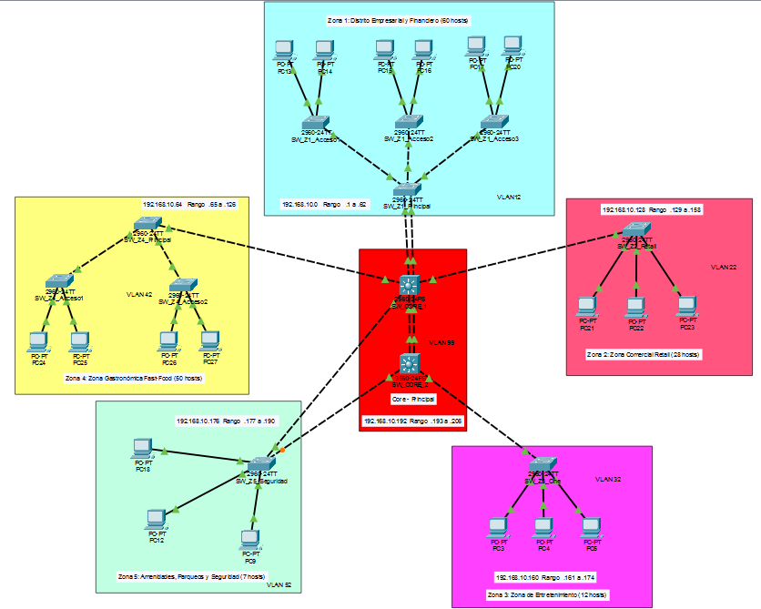
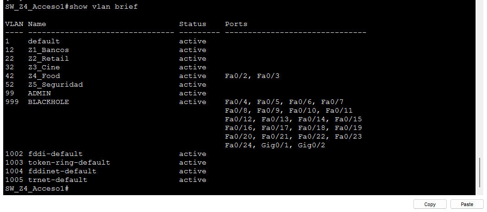
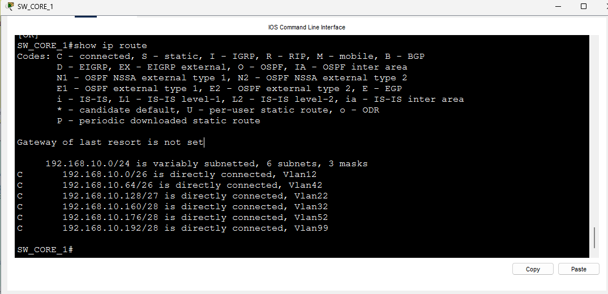
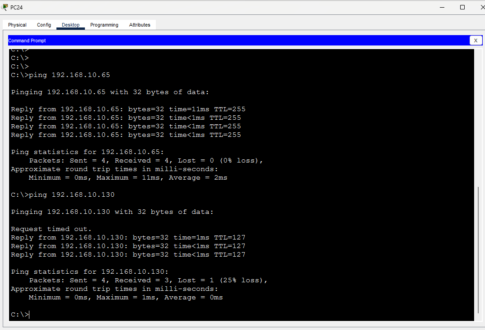

## UNIVERSIDAD DE SAN CARLOS DE GUATEMALA

### FACULTAD DE INGENIERÍA

### REDES DE COMPUTADORAS 1

  

# INFORME DE DESARROLLO

  

**Catedrático:** Ing. Pedro Pablo Hernández Ramirez

**Auxiliar:** César Fernando Sazo Quisquinay

**Nombre:** Pablo Daniel Velásquez Hernández

**Carnet:** 202302232

**Sección:** N

**Semestre:** Segundo Semestre 2026

  

# Informe De Desarrollo - Red de la Ciudad Comercial Cayalá

## Topología 

# Fase 1: Implementación del Backbone, Enlaces Troncales y EtherChannel

## 1. Descripción de la Implementación

Se procedió con el tendido de enlaces físicos y la configuración lógica del núcleo y la capa de distribución para la Zona 1. Para garantizar la simetría y estabilidad del protocolo LACP, se utilizó cableado cruzado (Copper Cross-over) uniendo interfaces con idénticas velocidades de transmisión (FastEthernet con FastEthernet y GigabitEthernet con GigabitEthernet).

Se crearon las VLANs administrativas de soporte (VLAN 99) y se establecieron los canales lógicos Port-Channel 1 y Port-Channel 2 en modo activo.

---

## 2. Problemas Encontrados y Soluciones Adoptadas

### Problema 1: Asimetría en la velocidad de medios de enlace y fallo de agregación LACP

| **Aspecto** | **Descripción** |
|---|---|
| **Inconveniente** | Inicialmente se conectaron interfaces FastEthernet de un switch con puertos GigabitEthernet en el extremo opuesto, ocasionando que LACP suspendiera los enlaces e imposibilitara la formación del canal lógico. |
| **Solución Adoptada** | Se reestructuró el cableado físico en Packet Tracer para asegurar enlaces simétricos en ambos extremos: Fa0/23-24 de SW_CORE_1 hacia Fa0/23-24 de SW_CORE_2, y Gig0/1-2 de SW_CORE_1 hacia Gig0/1-2 de SW_Z1_Principal. |

### Problema 2: Suspensión de puertos por inconsistencia de VLAN Nativa y error de máscara (vlan mask is different)

| **Aspecto** | **Descripción** |
|---|---|
| **Inconveniente** | Al intentar redefinir interfaces en uso en switches multicapa 3560 mediante el comando `default interface`, la consola rechazó la orden debido al modo troncal activo. Al intentar asociar las interfaces físicas al channel-group antes de igualar la VLAN nativa con el Port-Channel, Spanning Tree detectó inconsistencia de PVID (RECV_PVID_ERR) y bloqueó los puertos bajo el estado SD (Layer 2 Down). |
| **Solución Adoptada** | Se estructuró una secuencia CLI determinista: configurar la encapsulación dot1q, establecer la VLAN nativa 99 y definir la lista de VLANs permitidas directamente en las interfaces físicas primero, para posteriormente vincularlas al channel-group 1/2 mode active. Una vez reingresada la secuencia en ambos extremos y acelerada la convergencia del simulador (Fast Forward Time), el canal cambió de manera permanente al estado operativo Po1(SU) y Po2(SU). |

---

## 3. Capturas de Pantalla y Evidencias de Funcionamiento

### Imagen 1: `show etherchannel summary` en SW_CORE_1

**Descripción de la evidencia:** Muestra la correcta formación de Group 1 (Po1) y Group 2 (Po2) utilizando el protocolo LACP. Se evidencian las banderas SU (Layer 2 / In use) y la marca (P) (In port-channel) en los miembros Fa0/23, Fa0/24, Gig0/1 y Gig0/2, confirmando que los enlaces están agrupados y transmitiendo tráfico.

### Imagen 2: `show interfaces trunk`

**Descripción de la evidencia:** Demuestra la presencia de las interfaces lógicas Po1 y Po2 operando bajo encapsulación 802.1q, con la VLAN Nativa asignada a la 99 y restringiendo el tráfico de datos estrictamente a las VLANs 12, 22, 32, 42, 52, 99.

# Despliegue de Enlaces Troncales de Acceso y Distribución

## 1. Descripción de la Implementación

Se procedió con la configuración de las interfaces troncales entre los switches de distribución y acceso de todas las zonas de Ciudad Cayalá. Se aseguró que cada enlace mantuviera la coherencia en la VLAN Nativa (VLAN 99) y en la lista de VLANs autorizadas para evitar discrepancias de tráfico a nivel de Capa 2.

---

## 2. Problemas Encontrados y Soluciones Adoptadas

### Problema: Puerto en estado de bloqueo temporal (Luz Naranja) entre SW_CORE_1 y SW_Z4_Principal

| **Aspecto** | **Descripción** |
|---|---|
| **Inconveniente** | Al aplicar la configuración de tronco en la interfaz Fa0/15 de SW_CORE_1, el enlace se mantuvo en color naranja por varios segundos, impidiendo la transmisión inmediata. |
| **Solución Adoptada** | Se identificó que el puerto se encontraba en el proceso estándar de convergencia de Spanning Tree (Listening / Learning). Se avanzó el tiempo en el simulador (Fast Forward Time) para permitir que el estado cambiara a Forwarding (luz verde). |

### Problema: Estado `none` en las secciones de VLANs activas de `show interfaces trunk`

| **Aspecto** | **Descripción** |
|---|---|
| **Inconveniente** | Al verificar los troncales en SW_Z4_Principal, las secciones `Vlans allowed and active` y `Vlans in spanning tree forwarding state` mostraban `none`. |
| **Solución Adoptada** | Se confirmó que esto es un comportamiento normal de la Capa 2 cuando las VLANs aún no existen localmente en la base de datos del switch ni se han propagado por VTP. Se verificó que la línea `Vlans allowed on trunk` mostrara correctamente `12,22,32,42,52,99`, validando que la sintaxis del tronco estaba correctamente aplicada a la espera de la creación de las VLANs. |

---

## 3. Capturas de Pantalla y Evidencias de Funcionamiento

### Imagen 1: `show interfaces trunk` en SW_Z4_Principal

**Descripción de la evidencia:** Muestra las interfaces Fa0/1, Fa0/2 y Fa0/24 operando en modo trunking bajo encapsulación 802.1q, confirmando que la VLAN Nativa está asignada a la 99 y que únicamente las VLANs 12, 22, 32, 42, 52, 99 están permitidas.

### Imagen 2: `show interfaces trunk` en SW_Z1_Principal

**Descripción de la evidencia:** Demuestra los enlaces troncales activos hacia los switches de acceso (Fa0/1, Fa0/2, Fa0/3) y el canal Po2 hacia el Core, confirmando que la VLAN 99 figura como activa en el dominio de administración.

## Resumen: Configuración de VTP (Dominio 202302232)

Se configuró el protocolo **VTP (VLAN Trunking Protocol)** con el objetivo de centralizar la administración de VLANs en la red de Ciudad Cayalá, utilizando un dominio común basado en el carnet del estudiante (`202302232`) y una contraseña compartida (`redes1`).

**Switches Servidores (VTP Server):** Se configuraron explícitamente como servidores `SW_CORE_1` y los switches principales de cada zona (`SW_Z1_Principal`, `SW_Z2_Retail`, `SW_Z3_Cine`, `SW_Z4_Principal` y `SW_Z5_Seguridad`), aplicando los comandos `vtp domain 202302232`, `vtp password redes1` y `vtp mode server`.

**Switches Clientes (VTP Client):** Se configuraron como clientes el Core de respaldo `SW_CORE_2` y todos los switches de acceso (`SW_Z1_Acceso1`, `SW_Z1_Acceso2`, `SW_Z1_Acceso3`, `SW_Z4_Acceso1`, `SW_Z4_Acceso2`), aplicando los comandos `vtp domain 202302232`, `vtp password redes1` y `vtp mode client`. Estos switches no pueden crear, eliminar ni modificar VLANs; únicamente reciben las actualizaciones del servidor.

**Verificación:** Se utilizó el comando `show vtp status` en los switches clientes, confirmando que el `VTP Operating Mode` es `Client`, el `VTP Domain Name` es `202302232` y el `Configuration Revision` permanece en `0` hasta la creación de las VLANs en el paso siguiente.

Este procedimiento garantiza que el dominio VTP quede correctamente definido y que todos los switches clientes queden sincronizados con el servidor principal.

# Creación de la Base de Datos de VLANs y Verificación de Estado Troncal

## 1. Descripción de la Implementación

Se ejecutó la creación centralizada de la base de datos de VLANs en el switch principal de distribución SW_CORE_1. La infraestructura respondió sincronizando las bases de datos locales en el resto de los dispositivos, lo cual incrementó la revisión de configuración de VTP a 20 y elevó el número total de VLANs existentes a 12 (5 por defecto de fábrica + 7 administradas). Esto permitió activar inmediatamente la transmisión de tráfico etiquetado 802.1Q a través de los enlaces troncales físicos y agregados (Po2).

## 2. Problemas Encontrados y Soluciones Adoptadas

### Problema: Enlaces Troncales inactivos para VLANs específicas en la fase previa

| **Aspecto** | **Descripción** |
|---|---|
| **Inconveniente** | Previo a la creación de las VLANs, la verificación mediante `show interfaces trunk` reportaba el parámetro `none` en las secciones `Vlans allowed and active in management domain` y `Vlans in spanning tree forwarding state`, a pesar de contar con la regla `allowed vlan` bien configurada. |
| **Solución Adoptada** | Al inyectar la base de datos de VLANs centralmente y propagarse vía VTP, el motor de conmutación de los switches reconoció la existencia de las IDs 12, 22, 32, 42, 52, 99, pasando las interfaces automáticamente al estado activo y de reenvío de tramas (forwarding state). |

## 3. Capturas de Pantalla y Evidencias de Funcionamiento

### Imagen 1: `show vlan brief` en SW_Z1_Principal

**Descripción de la evidencia:** Se comprueba que el switch ha registrado satisfactoriamente en estado `active` todas las VLANs correspondientes a la topología (Z1_Bancos, Z2_Retail, Z3_Cine, Z4_Food, Z5_Seguridad, ADMIN y BLACKHOLE).

### Imagen 2: `show vtp status` en SW_Z1_Principal

**Descripción de la evidencia:** Muestra el estado del protocolo VTP confirmando un Configuration Revision en 20 y un total de 12 VLANs existentes, validando que la propagación desde el VTP Server se realizó de forma consistente sin pérdidas de sincronización.

### Imagen 3: `show interfaces trunk` en SW_Z1_Principal

**Descripción de la evidencia:** Muestra que las interfaces Po2, Fa0/1, Fa0/2 y Fa0/3 tienen activas y en estado de conmutación Spanning Tree (Forwarding state and not pruned) todas las VLANs requeridas (12, 22, 32, 42, 52, 99).

# Implementación de Rapid PVST+ y Control Jerárquico de Root Bridges

## 1. Descripción de la Implementación

Se migró la topología completa del modo Spanning Tree tradicional 802.1D al modo de convergencia rápida Rapid PVST+ (rstp). Se forzó manualmente a SW_CORE_1 a convertirse en el Root Bridge de todas las VLANs activas (12, 22, 32, 42, 52, 99) mediante el establecimiento de su prioridad en 4096. Asimismo, se aseguró la alta disponibilidad configurando a SW_CORE_2 con prioridad 8192 como nodo de respaldo automático.

## 2. Problemas Encontrados y Soluciones Adoptadas

### Problema: Tiempos de bloqueo prolongados (30-50s) durante fallos de enlace en STP por defecto

| **Aspecto** | **Descripción** |
|---|---|
| **Inconveniente** | Con el protocolo Spanning Tree estándar (802.1D), la conmutación entre puertos activos y bloqueados demoraba hasta 50 segundos, generando pérdida de paquetes prolongada. |
| **Solución Adoptada** | Se activó de manera global el comando `spanning-tree mode rapid-pvst` en todos los switches, reduciendo los estados de transición a menos de 2 segundos mediante mecanismos de propuesta/acuerdo (proposal/agreement). |

### Problema: Elección impredecible del Root Bridge basada en la dirección MAC más baja

| **Aspecto** | **Descripción** |
|---|---|
| **Inconveniente** | Si no se especifican las prioridades, la red selecciona como Root Bridge el switch con la dirección MAC más baja, el cual podría ser un switch de acceso de menor capacidad. |
| **Solución Adoptada** | Se asignó explícitamente la prioridad 4096 a SW_CORE_1, garantizando centralización del tráfico, rendimiento óptimo del backend y que todas sus interfaces permanezcan en estado designado y reenvío (Desg FWD). |

## 3. Capturas de Pantalla y Evidencias de Funcionamiento

### Imagen 1: `show spanning-tree vlan 12` en SW_CORE_1

**Descripción de la evidencia:** Muestra la leyenda explícita `This bridge is the root`, confirmando una prioridad de 4108 (4096 + 12) con la dirección MAC 000A.411A.5535. Todas sus interfaces físicas e interfaces de canal (Po1, Po2) se visualizan en estado designado y reenvío (Desg FWD).

### Imagen 2: `show spanning-tree vlan 12` en SW_CORE_2

**Descripción de la evidencia:** Comprueba la función de Root Secundario con una prioridad asignada de 8204 (8192 + 12). Identifica correctamente a SW_CORE_1 como el Root ID a través de su interfaz Po1 (Root Port) con costo 12.

### Imagen 3: `show spanning-tree vlan 12` en SW_Z4_Acceso2

**Descripción de la evidencia:** Demuestra el comportamiento de un switch de acceso operando en modo rstp, con la prioridad por defecto de 32780 (32768 + 12), reconociendo a SW_CORE_1 como la raíz del árbol a través del puerto troncal Fa0/1 (Root FWD) con costo acumulado 38.

# Asignación de Accesos a Terminales, Optimización PortFast y Hardening de Puertos (Blackhole)

## 1. Descripción de la Implementación

Se procedió con la segregación del tráfico de usuario final mapeando los puertos de los switches de acceso a las VLANs correspondientes de cada zona comercial. Para evitar retrasos en el inicio de sesión y solicitudes de IP por DHCP en las estaciones de trabajo, se habilitó el protocolo portfast en dichos puertos. Asimismo, se aplicó la práctica de aseguramiento (hardening) mandatoria, aislando todos los puertos libres en la VLAN 999 (BLACKHOLE) y apagándolos administrativamente.

## 2. Problemas Encontrados y Soluciones Adoptadas

### Problema: Retraso temporal de conectividad al encender o conectar una PC a los puertos de acceso

| **Aspecto** | **Descripción** |
|---|---|
| **Inconveniente** | Al conectar un dispositivo final, la interfaz permanecía en estado de negociación Spanning Tree (luz naranja) durante aproximadamente 30 segundos antes de permitir la transmisión de datos. |
| **Solución Adoptada** | Se ejecutó el comando `spanning-tree portfast` en los rangos de puertos de acceso a terminales (Fa0/2 - 3 en Zona 4, Fa0/2 - 10 en Zona 1, etc.), garantizando que las interfaces pasen de forma instantánea al estado Forwarding (luz verde) al detectar enlace físico. |

### Problema: Riesgo de intrusión y ataques de Capa 2 en puertos físicos de conmutador no utilizados

| **Aspecto** | **Descripción** |
|---|---|
| **Inconveniente** | Dejar las interfaces libres en la VLAN por defecto (VLAN 1) exponía la red a accesos no autorizados, ataques de salto de VLAN (VLAN hopping) o bucles accidentales. |
| **Solución Adoptada** | Se reasignaron masivamente todos los puertos libres a la VLAN aislada 999 (BLACKHOLE) sin enrutamiento ni acceso a recursos, y se forzó el estado administrativo apagado (`shutdown`). |

## 3. Capturas de Pantalla y Evidencias de Funcionamiento

### Imagen: `show vlan brief` en SW_Z4_Acceso1

**Descripción de la evidencia:** Muestra la asignación de puertos en el switch de acceso de la Zona 4. Se observa que la VLAN 42 (Z4_Food) contiene únicamente los puertos activos de terminales (Fa0/2 y Fa0/3), mientras que la VLAN 999 (BLACKHOLE) concentra la totalidad de puertos no utilizados (Fa0/4 a Fa0/24 y Gig0/1 - Gig0/2). El puerto Fa0/1 no figura en la lista de acceso por estar operando correctamente en modo trunking.

# Habilitación de Enrutamiento Inter-VLAN, Direccionamiento de Hosts y Pruebas de Conectividad Extremo a Extremo

## 1. Descripción de la Implementación

Se habilitó el enrutamiento de Capa 3 centralizado en SW_CORE_1 mediante el comando `ip routing` y la creación de sus SVIs asociadas. Se procedió a configurar la pila IP estática (IP, Máscara de Subred y Default Gateway) en la totalidad de estaciones de trabajo pertenecientes a las 5 zonas comerciales. Finalmente, se realizaron pruebas exhaustivas de ICMP (ping) para comprobar la conectividad intra-VLAN e inter-VLAN.

## 2. Problemas Encontrados y Soluciones Adoptadas

### Problema: Mapeo erróneo de la dirección IP de Gateway en la SVI de la VLAN 42

| **Aspecto** | **Descripción** |
|---|---|
| **Inconveniente** | Durante las pruebas iniciales de ping desde PC24 (Zona 4) hacia su puerta de enlace (192.168.10.65), las solicitudes expiraban (Request timed out). Al revisar la tabla de enrutamiento en SW_CORE_1, se detectó que a la Vlan42 se le había asignado por error el segmento de la Zona 5 (192.168.10.176/28). |
| **Solución Adoptada** | Se reingresó a la interfaz de comando de SW_CORE_1, reconfigurando la `interface Vlan 42` con la IP 192.168.10.65 255.255.255.192 y la `interface Vlan 52` con 192.168.10.177 255.255.255.240. La tabla de enrutamiento se actualizó inmediatamente incorporando las 6 subredes directamente conectadas. |

### Problema: Pérdida del primer paquete ICMP en las pruebas inter-VLAN entre la Zona 4 y la Zona 2

| **Aspecto** | **Descripción** |
|---|---|
| **Inconveniente** | El primer paquete enviado desde PC24 (192.168.10.66) hacia PC21 (192.168.10.130) resultó en un timeout. |
| **Solución Adoptada** | Se determinó que es un comportamiento normal en redes Ethernet enrutadas, causado por la latencia en la resolución de la tabla ARP por parte de la SVI del Core. Los ráfagas subsecuentes registraron un 0% de pérdida con tiempos de respuesta de 1ms y TTL de 127. |

## 3. Capturas de Pantalla y Evidencias de Funcionamiento

### Imagen 1: `show ip route` en SW_CORE_1

**Descripción de la evidencia:** Muestra la tabla de enrutamiento del switch multicapa donde se aprecian las 6 subredes directamente conectadas con el prefijo C (192.168.10.0/26, 192.168.10.64/26, 192.168.10.128/27, 192.168.10.160/28, 192.168.10.176/28 y 192.168.10.192/28), validando que el motor de Capa 3 está activo y funcional.

### Imagen 2: `ping 192.168.10.65` y `ping 192.168.10.130` desde PC24

**Descripción de la evidencia:** Comprueba la conectividad exitosa local hacia el Default Gateway de la Zona 4 (192.168.10.65 - 0% de pérdida) y la conectividad Inter-VLAN exitosa hacia la PC21 de la Zona 2 (192.168.10.130 - 100% de éxito en la convergencia final con TTL=127).